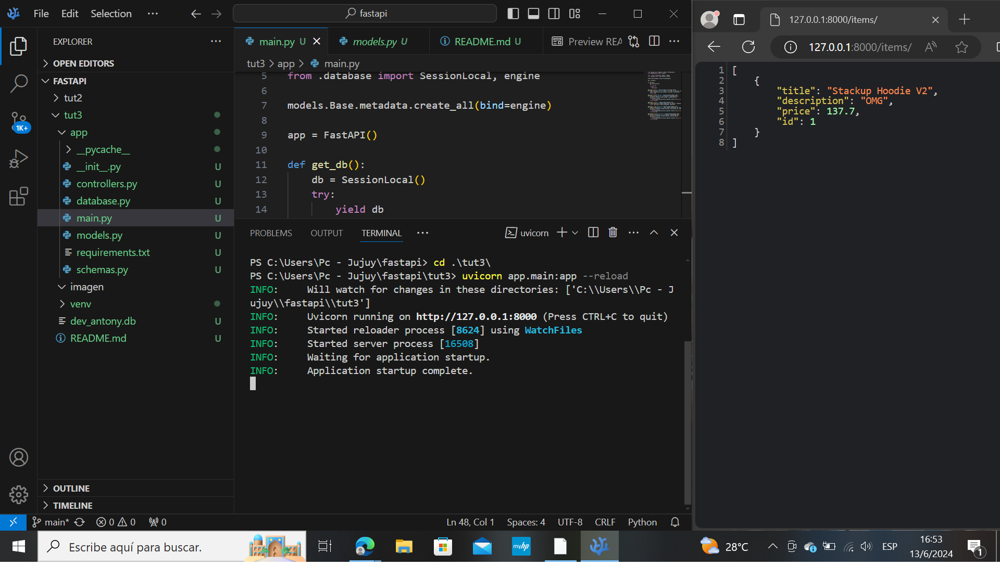
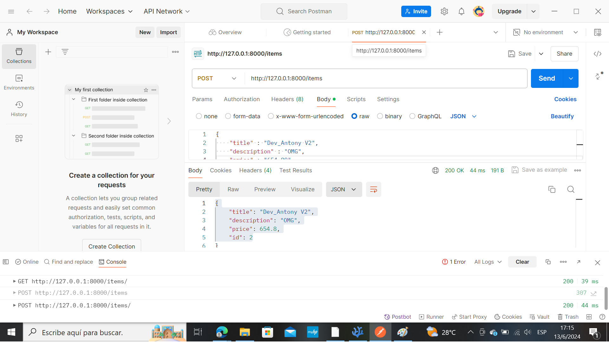
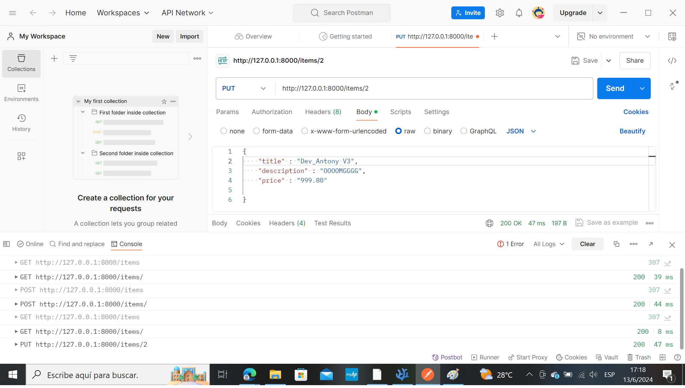

# Mejora del servidor FastAPI

        > Creación de un servidor de API completamente funcional

        > Integre SQLAlchemy con su API

        > Usar Postman para probar la API

## Introducción

Anteriormente, aprendió a crear rutas o puntos finales en FastAPI para que los usuarios creen, lean, actualicen y eliminen datos en su servidor.

Ahora aprenderá a integrar una base de datos en la aplicación utilizando SQLAlchemy con FastAPI, lo que permite a los usuarios interactuar con la base de datos a través del servidor API. Esto significa que las operaciones de creación, lectura, actualización y eliminación en su servidor ahora se pueden vincular directamente a una base de datos, almacenando o recuperando datos según sea necesario. La función de mapeo relacional de objetos (ORM) de SQLAlchemy es particularmente útil; le permite definir sus modelos de base de datos como clases de Python, lo que hace que sea más intuitivo trabajar con datos.

### Resumen de la aplicación

Desarrollaremos una aplicación web utilizando FastAPI y SQLalchemy. La aplicación se integrará con una base de datos SQLite para proporcionar contenido dinámico que los usuarios podrán leer y modificar. En nuestro caso, se trata de una lista de artículos que se puede utilizar para un sitio web de comercio electrónico o una aplicación de lista de tareas pendientes.

Anteriormente, usábamos un diccionario para nuestra aplicación y realizábamos operaciones CRUD en él, lo que lo hacía volátil ya que se reiniciaba cada vez que se ejecutaba la aplicación. Aquí, desarrollaremos un servidor API completamente funcional que puede ser escalable cuando se conecta a una base de datos como MySQL. Sin embargo, usaremos una base de datos SQLite para simplificar.

Las bases de datos SQLite se almacenan como archivos individuales en el disco, lo que las hace altamente portátiles y manejables. Son ampliamente utilizados en diversas aplicaciones, especialmente para aplicaciones que no requieren procesamiento de datos a gran escala. Proporciona una forma sencilla y eficiente de almacenar y recuperar datos estructurados, lo que la convierte en una opción popular para muchos desarrolladores.

Antes de comenzar, lea este artículo para comprender qué es SQLAlchemy y cómo se puede usar para hacer que las operaciones de base de datos sean más fluidas.

En resumen, SQLAlchemy es una potente biblioteca de Python que facilita la interacción con las bases de datos al abstraer las complejidades de la gestión de bases de datos. Permite a los usuarios crear, administrar y consultar bases de datos utilizando código Python, lo que permite una integración perfecta entre el código y el sistema de base de datos subyacente.

Usaremos SQLAlchemy para llevar a cabo operaciones de Crear, Leer, Actualizar y Eliminar (CRUD) en la base de datos para presentar una lista de productos y agregar una capa de autenticación usando Flask.

Para este proyecto, cree nuevas carpetas y archivos con la siguiente estructura de archivos.

Crea una carpeta de proyecto llamada tut3

Dentro de la carpeta tut3, crea 1 carpeta llamada app

Dentro de la carpeta de la aplicación, cree 7 archivos

        __init__.py

        controllers.py

        database.py

        main.py

        models.py

        requirements.txt

        schemas.py

A continuación, se muestra una breve descripción de lo que hará cada archivo.

**__init__.py**

 se utiliza para indicar que el directorio debe tratarse como un paquete de Python. No agregaremos ningún código a este archivo.

**controllers.py**

definirá nuestras funciones auxiliares que llevan a cabo las operaciones CRUD

**database.py**

contiene nuestro código de conexión a la base de datos

**models.py**

almacena nuestros objetos de base de datos para que SQLAlchemy los use

**requirements.txt**

se utiliza para introducir las dependencias que se instalarán

**schemas.py**

 definirá nuestras estructuras de datos para que las use Python.

Ejecute el siguiente comando en el directorio tut3 para inicializar su entorno virtual en el directorio venv/.

            python3 -m venv ./venv/

Para inicializar su entorno virtual, deberá ingresar el siguiente comando en su terminal.

            🪟 Usuarios de Windows: .\venv\Scripts\activate.bat

            🍎 Usuarios de MacOS y Linux: source ./venv/bin/activate

### Actualización de las dependencias

**requirements.txt**

                fastapi

                uvicorn

                pydantic

                sqlalchemy

                pip3 install -r requirements.txt

### Conexión de una base de datos

**database.py** 

                from sqlalchemy import create_engine
                from sqlalchemy.ext.declarative import declarative_base
                from sqlalchemy.orm import sessionmaker

                SQLALCHEMY_DATABASE_URL = "sqlite:///./dev_antony.db"

                engine = create_engine(
                    SQLALCHEMY_DATABASE_URL, connect_args={"check_same_thread": False}
                )
                SessionLocal = sessionmaker(autocommit=False, autoflush=False, bind=engine)

                Base = declarative_base()

### Creación de los modelos

**models.py**

                from sqlalchemy import create_engine

                from sqlalchemy.ext.declarative import declarative_base

                from sqlalchemy.orm import sessionmaker

                SQLALCHEMY_DATABASE_URL = "sqlite:///./STACKUP_USERNAME.db"

                engine = create_engine(

                SQLALCHEMY_DATABASE_URL, connect_args={"check_same_thread": False}
                )

                SessionLocal = sessionmaker(autocommit=False, autoflush=False, bind=engine)

                Base = declarative_base()

### Organización de los esquemas
                from pydantic import BaseModel

                class ItemBase(BaseModel):
                    title: str
                    description: str | None = None
                    price: float

                class ItemCreate(ItemBase):
                    pass

                class Item(ItemBase):
                    id: int

### Creación de los controladores

**controllers.py**

                from sqlalchemy.orm import Session

                from . import models, schemas

                def get_items(db: Session, skip: int = 0, limit: int = 100):
                    return db.query(models.Item).offset(skip).limit(limit).all()

                def get_item(db: Session, item_id: int):
                    return db.query(models.Item).filter(models.Item.id == item_id).first()

                def create_item(db: Session, item: schemas.ItemCreate):
                    db_item = models.Item(title=item.title, description=item.description, price=item.price)
                    db.add(db_item)
                    db.commit()
                    db.refresh(db_item)
                    return db_item

                def update_item(db: Session, item_id: int, item: schemas.ItemCreate):
                    db_item = db.query(models.Item).filter(models.Item.id == item_id).first()
                    db_item.title = item.title
                    db_item.description = item.description
                    db_item.price = item.price
                    db.commit()
                    db.refresh(db_item)
                    return db_item

                def delete_item(db: Session, item_id: int):
                    db_item = db.query(models.Item).filter(models.Item.id == item_id).first()
                    db.delete(db_item)
                    db.commit()
                    return db_item

### Poner todo junto

**main.py**

                    from fastapi import Depends, FastAPI, HTTPException
                    from sqlalchemy.orm import Session

                    from . import controllers, models, schemas
                    from .database import SessionLocal, engine

                    models.Base.metadata.create_all(bind=engine)

                    app = FastAPI()

                    def get_db():
                        db = SessionLocal()
                        try:
                            yield db
                        finally:
                            db.close()

                    @app.get("/items/", response_model=list[schemas.Item])
                    def read_items(skip: int = 0, limit: int = 100, db: Session = Depends(get_db)):
                        items = controllers.get_items(db, skip=skip, limit=limit)
                        return items

                    @app.get("/items/{item_id}", response_model=schemas.Item)
                    def read_item(item_id: int, db: Session = Depends(get_db)):
                        db_item = controllers.get_item(db, item_id=item_id)
                        if db_item is None:
                            raise HTTPException(status_code=404, detail="Item not found")
                        return db_item

                    @app.post("/items/", response_model=schemas.Item)
                    def create_item(item: schemas.ItemCreate, db: Session = Depends(get_db)):
                        return controllers.create_item(db=db, item=item)

                    @app.put("/items/{item_id}", response_model=schemas.Item)
                    def update_item(item_id: int, item: schemas.ItemCreate, db: Session = Depends(get_db)):
                        db_item = controllers.update_item(db, item_id=item_id, item=item)
                        if db_item is None:
                            raise HTTPException(status_code=404, detail="Item not found")
                        return db_item

                    @app.delete("/items/{item_id}", response_model=schemas.Item)
                    def delete_item(item_id: int, db: Session = Depends(get_db)):
                        db_item = controllers.delete_item(db, item_id=item_id)
                        if db_item is None:
                            raise HTTPException(status_code=404, detail="Item not found")
                        return db_item

## Ejecución del servidor de API

                uvicorn app.main:app --reload

## Prueba de la API (uso de Postman)

**crear un elemento**

**actualizar el elemento**

